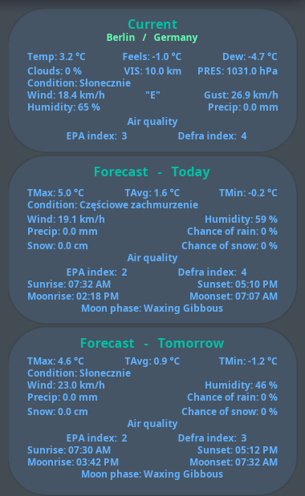
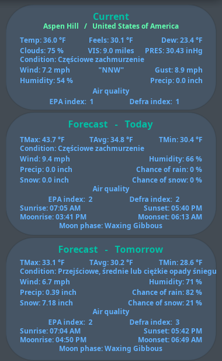

<p>
    <div align="center">
        <span style="color:aqua;"><h1>Conky-WeatherApi-QubesOS</h1></span>
    </div>
</p>

<p>
    <div align="justify">
        <span style="font-weight:bold;">Conky LUA-Cairo WeatherApi config for QubesOS / dom0</span>
    </div>
    <div align="justify">
        <span style="color:white;">v0.6.9:</san>
        <blockquote style="color:grey;">Text only widgets as I'm searching for usable SVG icon pack. Alternativelly I will convert orginal, small WeatherApi icons to SVG - but that's alot of work.</br>
        When I acquire suitable icon pack then I i will rewrite whole code to use images and less parameters to declutter widgets.</blockquote>
    </div>
</p>

<p>
    <div align="center">
        <table>
            <tr align="center">
                <td><span style="color:aqua;">Berlin - metric units</span></td>
                <td><span style="color:aqua;">Aspen - imperial units</span></td>
            </tr>
            <tr align="center">
                <td></td>
                <td></td>
            </tr>
        </table>
    </div>
</p>

<p></br></p>

<p>
    <h2></h2>
    <div align="center">
        <span style="color:red;"><h2>Prerequsites</h2></span>
    </div>
</p>

1. you need minimal disposable template connected to internet to run curl
2. you need Conky and dependencies installed
3. you need this config files package
4. you need WeatherApi API key
5. you need to edit 2 files in this Conky config to specify WheaterAPI API key to script and possition of widgets on screen and to correct path to startup script

<p>
    <h2></h2>
    <div align="center">
        <span style="color:red;"><h2>1.</h2></span>
    </div>
</p>

First of you need fedora minimal template. Yor naming shema is your thing but I'm naming tempates with prefix `tmpl`.</br>
If you don't have minimal fedora tempate then you need to install it.

You can do it from GUI by chosing `Q` icon in left top corner of the screen, chose , `Qubes Tools` and `Qubes Template Manager` (it work faster if network provider for `dom0` is `sys-firewal` and not `sys-whonix`). You click in `Status` column on desired template (`fedora-40-minimal` in my case) and change it from `Available` to `Install`.

Or you can do it from `dom0` terminal:
```
qvm-template install fedora-40-minimal
```

After installing fedora minimal template, rename it to your liking/schema (`tmpl-fedora-40-minimal` in my case), and run terminal in it to update it and install one small dependency:
```
sudo dnf upgrade
sudo dnf install qubes-core-agent-networking
```

Next you need to make disposable minimal template based on that fedora-40-minimal template (dom0 terminal only):
```
qvm-create --template tmpl-fedora-40-minmal --label purple dvm-minimal
qvm-prefs dvm-minimal template_for_dispvms true
qvm-features dvm-minimal appmenus-dispvm 1
```

Next you need make finishing touches in `dvm-minimal` settings:
- in `Basic` tab, make shure that it's based on `tmpl-fedora-40-minimal` and `sys-firewal` is it's network provider
- in `Advanced` tab, change `Default disposable template` from system disposable template to itself (to `dvm-minimal`)

<p>
    <h2></h2>
    <div align="center">
        <span style="color:red;"><h2>2.</h2></span>
    </div>
</p>

In `dom0` terminal install Conky with dependencies:
```
sudo dnf install conky lua cairo
```

<p>
    <h2></h2>
    <div align="center">
        <span style="color:red;"><h2>3.</h2></span>
    </div>
</p>

Download copy of this repository release either by `git` or from `packages`.
If you pulled it by `git` in appvm then you need to pack it's directory to `tar.gz` archive.</br>
Pull it from appvm in which you downloaded it to `dom0`  and unpack it there ( in `dom0` terminal)
```
mkdir ~/conky
cd conky
qvm-run --pass-io your-appvm-with-files "cat /home/user/Downloads/conky-weatherapi-qubesos-0.9.6.tar.gz" ./conky-weatherapi-qubesos-0.9.6.tar.gz
tar -xzvf ./conky-weatherapi-qubesos-0.9.6.tar.gz
chmod +X ./Conky-WeatherAPI-QubesOS/weatherapi-conky-start.sh
```

<p>
    <h2></h2>
    <div align="center">
        <span style="color:red;"><h2>4.</h2></span>
    </div>
</p>

Go to [WeatherApi website](https://www.weatherapi.com), signup for free account (1M queries a month - `if you ask curl about data 31 day a month, 24h a day and 60 times a hour` it gives you ~22 queries a minute, so more than enought).</br>
After that login to dashboard and copy API key to clipboard - you will need it for configuration.

<p>
    <h2></h2>
    <div align="center">
        <span style="color:red;"><h2>5.</h2></span>
    </div>
</p>

Go to `~/conky/Conky-WeatherAPI-QubeOS` directory and edit `weatherapi-conky-config.lua`.</br>
Over there you might change possition of Conky window, you can chose units `metric` or `imperial`, change name of disposable qube, `queryM` variable to how often to pull data from WeatherApi site (`WeatherApi` is updating it's data in API every 15 minutes so going below default amount is useless).</br>
But most importantly, in `weatherAPIurl` variable you need to paste your `WeaterApi key` and your town/city that you weather data want.

This config file have comments on every thing you can change so read it carefully.

Thats it.</br>
Now you can test if everythings ok by running startup script in terminal:
```
./weatherapi-conky-start.sh --nolog
```

If everything is ok and there is no errors in terminal and widgets apears with proper data you can go to `Conky-WeatherAPI-QubeOS/res/home` directory. Inside of it there are directory tree with `conky-icon.png` icon and `weatherapi-conky.desktop` file - copy them to the same directories to your `dom0` `home` directory (you can use `Thunar File Manager` for that).
Edit `weatherapi-conky.desktop` file to where you instaled this package (path to startup script need to have your proper username).

You're set. Next time you boot/reboot `WeatherApi` conky will run automatically.
